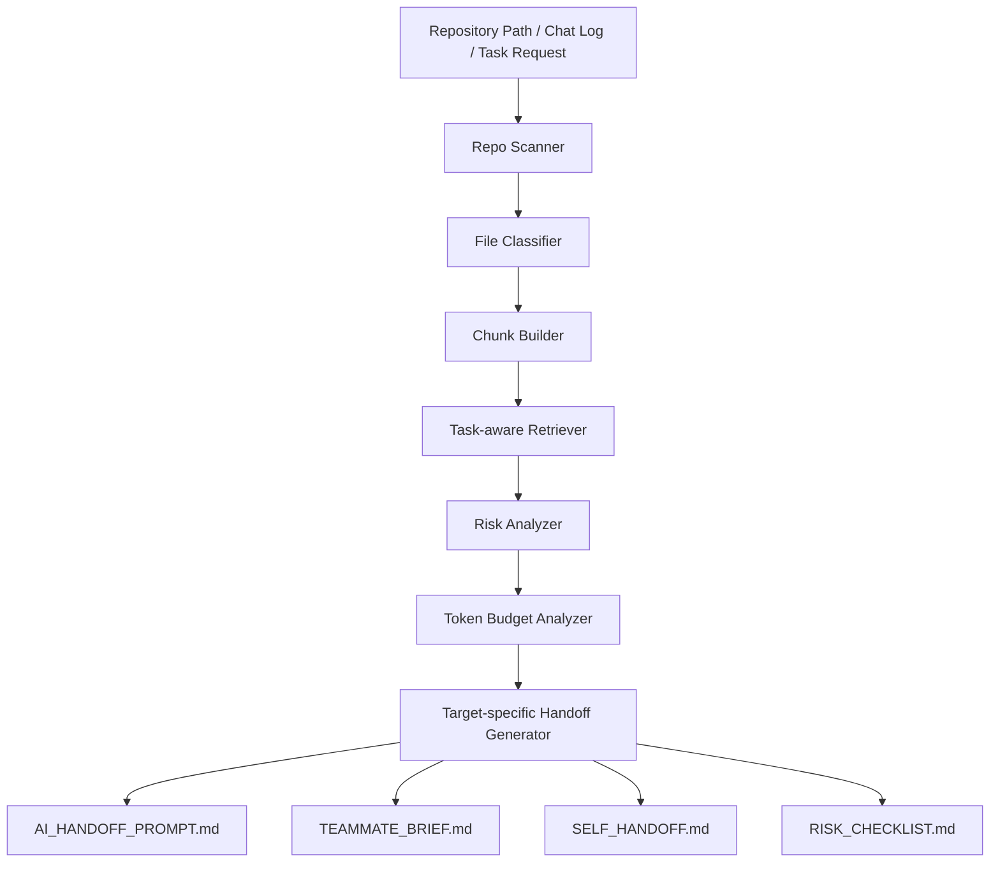

# Context Capsule

> 레포와 작업 요청을 분석해 AI 코딩 도구, 팀원, 미래의 나에게 넘길 수 있는 최소 컨텍스트 기반 작업 브리프를 생성하는 로컬 우선 RAG 인수인계 도구입니다.

Context Capsule은 막연한 요청을 실행 가능한 작업 브리프로 바꿉니다. 레포의 문서, 코드, 설정 파일, 최근 작업 흐름을 스캔하고 작업 요청과 관련 있는 컨텍스트만 선별한 뒤, 관련 파일, 위험 영역, 수정 금지사항, 완료 기준, 검증 방법, 승인 체크리스트를 Markdown 패킷으로 생성합니다.

핵심 목표는 AI 자동 개발이 아니라 **AI와 사람이 헛짓하지 않도록 작업 범위와 근거를 통제하는 것**입니다.

## 왜 만들었나

AI 코딩 도구나 팀원에게 작업을 넘길 때 단순히 "이거 고쳐줘"라고 하면 다음 문제가 반복됩니다.

- 프로젝트 목적과 구조를 매번 다시 설명해야 한다.
- AI나 팀원이 관련 없는 파일을 먼저 본다.
- API 응답, DB 스키마, 인증, 배포 설정 같은 위험 영역을 쉽게 건드린다.
- 금지사항과 팀 규칙이 대화 중간에 흐려진다.
- 완료 기준이 모호해 결과물이 어긋난다.
- 레포 전체를 읽고 찾느라 토큰과 시간이 낭비된다.

Context Capsule은 이 문제를 **작업을 잘 넘기기 위한 컨텍스트 압축 문제**로 봅니다. 레포 전체를 외부 모델에 던지는 대신, 로컬에서 먼저 찾고 줄이고 정리한 뒤 필요한 것만 넘깁니다.

## 핵심 컨셉

```text
막연한 요청 + 레포 컨텍스트
        ↓
관련 파일 검색
        ↓
위험 영역과 금지사항 분석
        ↓
대상별 작업 브리프 생성
        ↓
AI / 팀원 / 미래의 나에게 handoff
```

확장 비전은 Discord 회의에서 확정된 아이디어까지 이 흐름에 넣는 것입니다.

```text
Discord 회의에서 "이걸로 가자" 확정
        ↓
Decision Record 생성
        ↓
GitHub Issue / 작업 브리프 / AI handoff prompt 생성
        ↓
사람 승인 후 Claude / Codex / 팀원 작업 착수
```

예를 들어 사용자가 "로그인 API 에러났는데 봐줘"라고 입력하면 Context Capsule은 다음 형태로 바꿉니다.

```text
관련 파일:
- backend/auth/router.py
- backend/schemas/user.py
- frontend/src/api/auth.ts

원인 후보:
- 백엔드 response schema와 프론트 기대 필드 불일치 가능성
- JWT 발급/검증 로직 영향 가능성

수정 금지:
- JWT secret/env 값 수정 금지
- DB schema 변경 금지
- frontend 전체 구조 변경 금지

요청:
먼저 원인 후보와 수정 계획만 제안하고, 파일 수정은 사용자 승인 후 진행하세요.

검증:
- pytest 실행
- 로그인 성공/실패 케이스 확인
```

## 주요 모드

| Mode | 대상 | 생성 내용 |
| --- | --- | --- |
| AI Handoff Mode | Claude, Codex, ChatGPT | 최소 컨텍스트, 수정 범위, 금지사항, 검증 명령, 승인 조건 |
| Human Handoff Mode | 팀원, 주니어 개발자 | 먼저 볼 파일, 오늘 할 일, 완료 기준, 질문 목록 |
| Self Handoff Mode | 미래의 나 | 현재 상태, 막힌 점, 다음 작업, 주의사항 |

## 핵심 기능

| 기능 | 설명 |
| --- | --- |
| Repo Scanner | README, docs, 코드, 설정 파일을 수집하고 파일 유형을 분류합니다. |
| Task-aware Retrieval | 사용자의 작업 요청과 관련 있는 파일 조각을 검색합니다. |
| Risk Analyzer | DB, 인증, 배포, 환경변수, API 응답 변경 같은 위험 신호를 감지합니다. |
| Handoff Generator | AI/팀원/미래의 나 대상별 작업 브리프를 생성합니다. |
| Human Approval Checklist | 사람이 YES/NO로 확인해야 할 항목을 만듭니다. |
| Token Budget View | 원본 컨텍스트, 검색된 컨텍스트, handoff prompt의 예상 토큰 수와 절약 효과를 비교합니다. |
| Chat-to-Capsule | Discord/GPT 대화나 에러 로그에서 작업 요청, 파일 힌트, 결정 신호를 추출합니다. |
| Meeting-to-Execution Packet | GitHub Issue 초안, Decision Record, 자동착수 승인 게이트를 생성합니다. |
| Split Result Views | 사용자 화면은 바로 쓸 패킷만, 개발자 분석 화면은 검색/토큰/위험 분석을 보여줍니다. |

## 처리 흐름



## MVP 방향

현재 MVP는 외부 LLM API 없이 동작하는 것을 목표로 합니다.

- 검색: 로컬 파일 스캔 + 키워드/규칙 기반 검색부터 시작
- 생성: Markdown 템플릿 기반 capsule 생성
- 위험 분석: 규칙 기반 risk analyzer
- UI: Streamlit 기반 로컬 실행
- 다음 확장: Chroma/FAISS + 로컬 임베딩 기반 RAG
- 로컬 LLM 확장: provider adapter 기반 요약/압축 옵션
- 토큰 분석: 로컬 추정 기반으로 capsule 전후 토큰 수 비교

## 빠른 실행

```bash
git clone https://github.com/mosejong/context-capsule.git
cd context-capsule
python --version  # Python 3.13.x recommended
python -m venv .venv
source .venv/bin/activate  # Windows: .venv\Scripts\activate
pip install -r requirements.txt
streamlit run app/main.py
```

선택 설치:

```bash
pip install -r requirements-dev.txt        # tests
pip install -r requirements-rag.txt        # Chroma / embeddings
pip install -r requirements-local-llm.txt  # local LLM adapter notes
```

## 폐쇄망/보안 방향

Context Capsule은 외부 AI API가 없어도 최소 기능이 동작하도록 설계합니다.

폐쇄망 환경에서는 Claude, Codex, OpenAI 같은 외부 AI 도구를 사용할 수 없을 수 있습니다. 따라서 기본 기능은 로컬 레포 스캔, 파일 분류, 규칙 기반 검색, 위험도 분석, 대상별 작업 브리프 생성으로 구성합니다.

| Mode | 설명 |
| --- | --- |
| No-AI Mode | 로컬 레포 스캔, 키워드 검색, 위험도 분석, 작업 브리프, 개발일지, 토큰 추정 |
| Local-AI Mode | 로컬 임베딩, Chroma/FAISS, llama.cpp/Ollama 기반 로컬 요약 |
| External-AI Mode | Claude/Codex/OpenAI 같은 외부 AI에 handoff prompt 전달 |

- `.env`, secret, credential 파일은 기본 제외 또는 redaction
- 외부 API 호출 없이 Markdown capsule, 팀원 작업 가이드, 내일의 나 메모, GitHub Issue 초안 생성 가능
- 로컬 LLM 또는 로컬 임베딩 모델이 있으면 요약/RAG 품질을 선택적으로 개선
- 로컬 모델이 없어도 핵심 인수인계 기능은 동작해야 함

## 출력 예시

```md
# AI Handoff Packet

## Task Request
로그인 API 오류 원인을 분석하고 수정안을 제안한다.

## Relevant Context
- backend/auth/router.py
- backend/models/user.py
- frontend/src/pages/Login.jsx
- docker-compose.yml

## Risk Notes
- JWT 발급 로직 변경 시 전체 로그인 흐름에 영향 가능
- API 응답 스키마 변경 시 프론트 로그인 페이지에 영향 가능
- 환경변수와 secret 값은 수정 금지

## AI Instruction
아래 범위 안에서만 수정안을 제안하세요. 직접 적용하지 말고, 변경 파일과 예상 영향도를 먼저 설명하세요.
```

## 프로젝트 원칙

1. AI는 자동 적용하지 않는다.
2. AI는 수정 전에 근거와 영향도를 설명해야 한다.
3. 위험도가 높은 작업은 사람 승인 없이는 진행하지 않는다.
4. 팀 성과와 개인 기여, 추정과 사실을 구분한다.
5. 컨텍스트는 길게 모으는 것이 아니라, 작업에 필요한 만큼만 검색해 조립한다.
6. 외부 모델에 보내기 전 로컬에서 민감정보와 불필요 컨텍스트를 줄인다.

## 문서

- [PROJECT_PLAN.md](./PROJECT_PLAN.md)
- [Prototype Progress](./PROTOTYPE_PROGRESS.md)
- [Architecture](./docs/architecture.md)
- [Future Direction](./docs/future_direction.md)
- [Meeting-to-Execution Pipeline](./docs/meeting_to_execution_pipeline.md)
- [Validation](./docs/validation.md)
- [Performance Comparison](./docs/reports/performance_comparison.md)
- [LLM Tech Scan](./docs/research/llm_tech_scan_2026-06-22.md)
- [Paid API Impact Scan](./docs/research/paid_api_impact_scan_2026-06-22.md)
- [Rainbow Bridge sample capsule](./examples/rainbow_bridge_capsule.md)

## Tech Stack

- Python 3.13
- Streamlit
- Pydantic
- Keyword retrieval MVP
- Token analyzer MVP
- Chat-to-Capsule MVP
- Meeting-to-Execution packet MVP
- Chroma / FAISS planned
- Sentence Transformers planned
- Local LLM adapter planned
- pytest

## Saved Output Packet

After generating a capsule in the dashboard, open the `Saved Packet` tab and click `Save packet to outputs/`.
Context Capsule writes a reusable work packet under `outputs/YYYYMMDD_HHMMSS_slug/`.

Generated files:

- `OVERVIEW.md`
- `AI_HANDOFF_PROMPT.md`
- `TEAMMATE_BRIEF.md`
- `JUNIOR_GUIDE.md`
- `SELF_HANDOFF.md`
- `RISK_CHECKLIST.md`
- `GITHUB_ISSUE.md`
- `DECISION_RECORD.md`
- `CONTEXT_CAPSULE.md`
- `metadata.json`

`outputs/` is ignored by git because it contains local run artifacts. The next Discord/GitHub adapter can use this saved packet as the handoff boundary.

각 모델과 기술이 어디에 붙는지는 [Architecture](./docs/architecture.md)의 `Models and Technologies` 섹션에 정리했습니다.

## Roadmap

- [x] 레포 생성 및 초기 구조 설계
- [x] 로컬 레포 스캐너 구현
- [x] 파일 분류 및 chunk 생성
- [x] 작업 요청 기반 검색 구현
- [x] 위험 규칙 엔진 구현
- [x] Markdown capsule 생성
- [x] AI/Human/Self handoff target 추가
- [x] 토큰 분석기 연동
- [x] Chat-to-Capsule 입력 모드 추가
- [x] MVP/RAG/로컬 LLM 의존성 분리
- [ ] Chroma 기반 RAG 확장
- [ ] 자체 위험도 분류 모델 학습
- [ ] Local LLM provider adapter 연동
- [x] Meeting-to-Execution packet 생성
- [x] outputs 저장 패킷 생성
- [x] MVP 시나리오 검증 스크립트 추가
- [ ] Discord API / GitHub Issue adapter 연동
- [ ] 폐쇄망 설치 번들 설계

## 검증

```powershell
.\.venv\Scripts\python.exe -m pytest -q
.\.venv\Scripts\python.exe scripts\validate_mvp.py --repeat 5
```

반복 검증 기준은 [Validation](./docs/validation.md)에 정리했습니다.

성능 비교 표와 그림은 [Performance Comparison](./docs/reports/performance_comparison.md)에서 확인할 수 있습니다.
