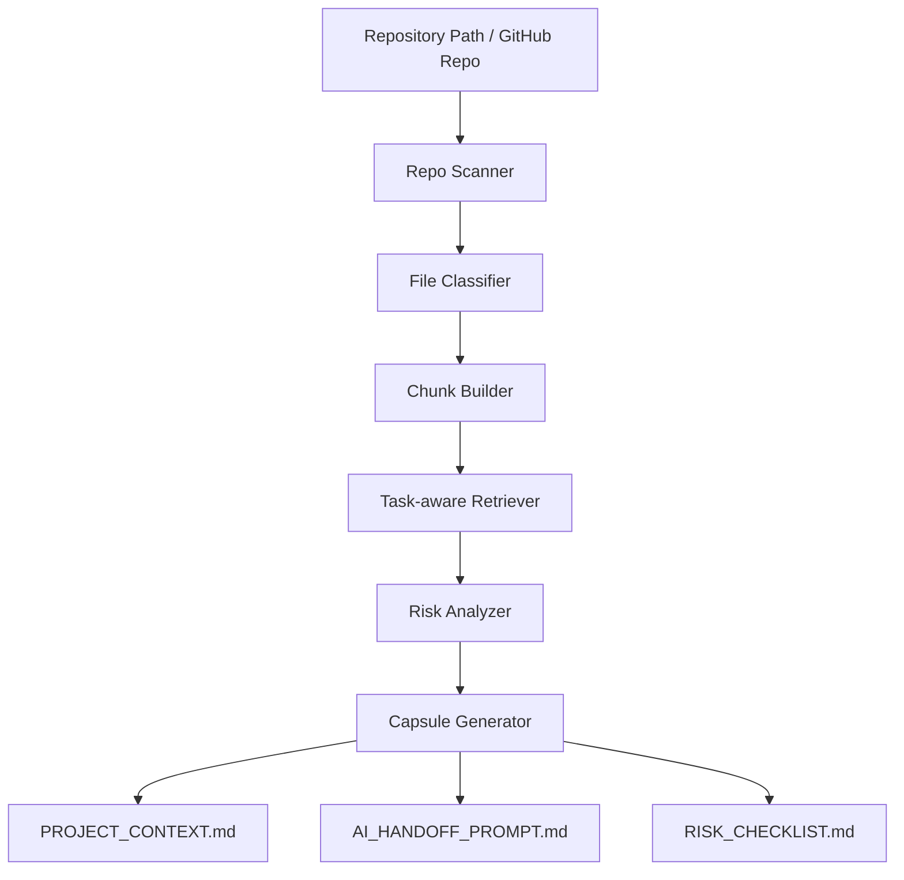

# Context Capsule

> RAG 기반으로 레포 컨텍스트와 작업 위험도를 분석해 AI 코딩 도구용 인수인계 패킷을 생성하는 human-in-the-loop 개발 보조 도구입니다.

Context Capsule은 Claude Code, Codex, ChatGPT 같은 AI 코딩 도구에 프로젝트를 넘기기 전에 필요한 정보를 정리합니다. 레포의 문서·코드·설정 파일을 스캔하고, 사용자의 작업 요청에 맞는 관련 컨텍스트를 검색한 뒤, 위험 영역과 승인 체크리스트가 포함된 Markdown 패킷을 생성합니다.

## 왜 만들었나

AI 코딩 도구는 강력하지만, 프로젝트 맥락이 부족하면 다음 문제가 자주 발생합니다.

- 기존 구조를 모르고 새 파일을 만든다.
- API 응답 형식, DB 스키마, 인증 로직 같은 위험 영역을 쉽게 건드린다.
- 사용자가 원하는 범위보다 크게 수정한다.
- 금지사항이나 팀 규칙을 대화 중간에 잊는다.
- 매번 프로젝트 설명을 다시 해야 한다.

Context Capsule은 AI에게 바로 수정을 맡기는 도구가 아니라, **AI가 헛짓하지 않도록 사람이 작업 범위와 근거를 통제하는 도구**입니다.

## 핵심 기능

| 기능 | 설명 |
| --- | --- |
| Repo Scanner | README, docs, 코드, 설정 파일을 수집하고 파일 유형을 분류합니다. |
| Task-aware Retrieval | 사용자의 작업 요청과 관련 있는 파일 조각을 검색합니다. |
| Risk Analyzer | DB, 인증, 배포, 환경변수, API 응답 변경 같은 위험 신호를 감지합니다. |
| Handoff Prompt Generator | AI 코딩 도구에 넘길 작업 지시 프롬프트를 생성합니다. |
| Human Approval Checklist | 사람이 YES/NO로 확인해야 할 항목을 만듭니다. |

## 처리 흐름



## MVP 방향

초기 버전은 외부 LLM API 없이 동작하는 것을 목표로 합니다.

- 검색: 로컬 파일 스캔 + 키워드/규칙 기반 검색부터 시작
- RAG 확장: Chroma 또는 FAISS + Sentence Transformers
- 생성: Markdown 템플릿 기반 생성
- 모델 확장: 작업 위험도 분류기 자체 학습
- LLM 확장: Ollama 기반 로컬 LLM 연동

## 빠른 실행

```bash
git clone https://github.com/mosejong/context-capsule.git
cd context-capsule
python -m venv .venv
source .venv/bin/activate  # Windows: .venv\Scripts\activate
pip install -r requirements.txt
streamlit run app/main.py
```

## 출력 예시

```md
# AI Handoff Packet

## Project Summary
이 프로젝트는 펫로스 보호자를 위한 AI 애프터케어 서비스입니다.

## Task Request
로그인 API 오류 원인을 분석하고 수정안을 제안한다.

## Relevant Context
- backend/auth/router.py
- backend/models/user.py
- frontend/src/pages/Login.jsx
- docker-compose.yml

## Risk Notes
- JWT 발급 로직 변경 시 전체 로그인 흐름에 영향 가능
- API 응답 스키마 변경 시 프론트 로그인 페이지에 영향 가능
- 환경변수와 secret 값은 수정 금지

## AI Instruction
아래 범위 안에서만 수정안을 제안하세요. 직접 적용하지 말고, 변경 파일과 예상 영향도를 먼저 설명하세요.
```

## 프로젝트 원칙

1. AI는 자동 적용하지 않는다.
2. AI는 수정 전에 근거와 영향도를 설명해야 한다.
3. 위험도가 높은 작업은 사람 승인 없이는 진행하지 않는다.
4. 팀 성과와 개인 기여, 추정과 사실을 구분한다.
5. 컨텍스트는 길게 모으는 것이 아니라, 작업에 필요한 만큼만 검색해 조립한다.

## 문서

- [PROJECT_PLAN.md](./PROJECT_PLAN.md)
- [Architecture](./docs/architecture.md)
- [Rainbow Bridge sample capsule](./examples/rainbow_bridge_capsule.md)

## Tech Stack

- Python
- Streamlit
- Pydantic
- Chroma / FAISS planned
- Sentence Transformers planned
- Ollama planned
- pytest

## Roadmap

- [x] 레포 생성 및 초기 구조 설계
- [ ] 로컬 레포 스캐너 구현
- [ ] 파일 분류 및 chunk 생성
- [ ] 작업 요청 기반 검색 구현
- [ ] 위험 규칙 엔진 구현
- [ ] Markdown capsule 생성
- [ ] Chroma 기반 RAG 확장
- [ ] 자체 위험도 분류 모델 학습
- [ ] Ollama 로컬 LLM 연동
