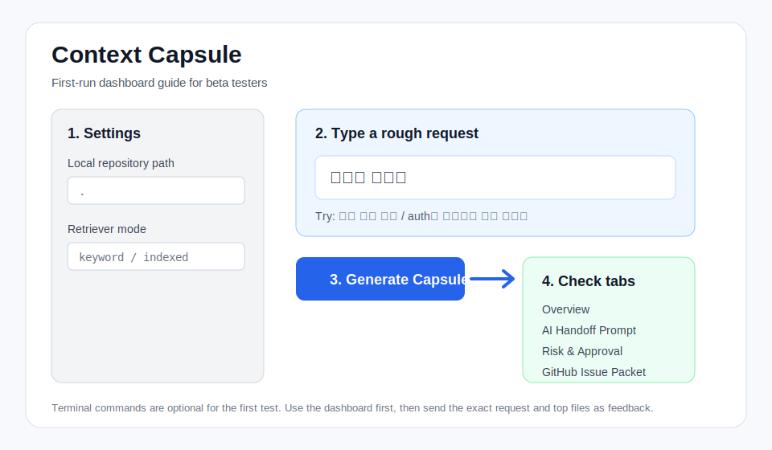

# Context Capsule

AI에게 일을 맡기기 전에, **무엇을 봐야 하는지, 무엇을 건드리면 안 되는지, 어떤 결과가 나와야 하는지** 정리해주는 로컬 도구입니다.

신입 개발자가 AI에게 `로그인 오류 고쳐줘`, `리드미 손보자`, `로컬 실행 안돼`처럼 말하면 AI가 너무 많은 파일을 보거나 위험한 영역까지 건드릴 수 있습니다. Context Capsule은 먼저 작업 요청을 해석하고, 관련 파일·금지 범위·완료 기준·AI에게 넘길 지시문을 작업 정리본으로 만듭니다.

한 줄로 말하면:

```text
AI가 아무 파일이나 보고 아무렇게나 고치지 않게,
사람이 먼저 작업 범위와 참고 자료를 정리해주는 도구입니다.
```

This repository is the public local MVP of Context Capsule for portfolio use, KDT learner testing, and early feedback. Commercialization is deferred; the current focus is building a useful public beta.

## Who It Is For

### Primary User: Junior Developers

- AI에게 어떤 파일을 보여줘야 할지 막막한 사람
- 작업 범위와 금지사항을 명확히 정리하고 싶은 사람
- 팀 프로젝트에서 README, 이슈, 회의록, 작업 브리프를 자주 만드는 사람
- AI가 엉뚱한 파일을 수정하지 않도록 먼저 통제하고 싶은 사람

### Secondary Reader: Team Leads, Interviewers, AI Beginners

- 신입 개발자가 AI를 안전하게 쓰는 방식을 보고 싶은 사람
- 결과물보다 문제 정의, 검증, 위험 통제 습관을 보고 싶은 사람
- AI, RAG, LLM, 토큰 같은 용어에 익숙하지 않아도 사용 흐름을 이해해야 하는 사람

## What You Put In / What You Get

| Input | Output |
| --- | --- |
| `리드미 손보자` | 먼저 볼 `README.md`, 문서 수정 주의사항, AI에게 넘길 지시문 |
| `로그인이 모바일에서만 안돼` | 로그인 관련 파일 후보, 위험 영역, 검증 체크리스트 |
| `auth는 건드리지 말고 문서만` | 문서 후보 + `auth` 보호 영역 표시 |
| 회의록/스크럼 메모 | 결정사항, 막힌 점, 다음 작업, GitHub Issue 초안 |

## How It Reduces AI Waste

Context Capsule does not directly lower Claude/GPT billing by itself. It makes the **prompt you send to AI smaller and more focused**.

| Common AI Use | Context Capsule Use |
| --- | --- |
| AI에게 전체 프로젝트를 넓게 보여줌 | 작업 요청을 먼저 해석함 |
| 필요 없는 파일까지 많이 읽음 | 필요한 문서와 코드 후보만 추림 |
| 건드리면 안 되는 파일도 수정할 수 있음 | 금지 범위와 승인 체크리스트를 붙임 |
| 결과가 넓고 검증하기 어려움 | 완료 기준과 검증 방법을 함께 정리함 |

```text
Before
  "이 프로젝트 전체 보고 로그인 오류 고쳐줘"
  -> README, 문서, 코드, 설정을 넓게 탐색

After
  Context Capsule
  -> backend/auth/login.py
  -> frontend login API client
  -> .env/JWT secret 수정 금지
  -> 먼저 원인 후보와 수정 계획만 제안
```

Token numbers shown by the app are **Estimated only** local estimates. They are evidence for "how much the generated instruction was compressed," not provider billing guarantees.

## Experiment Snapshot

Raw repository prompts and Context Capsule prompts were compared across Haiku, Sonnet, and Opus on three repositories. The main finding is not that one model is always better. The main finding is that **better context makes models behave similarly well**.

```text
Raw answer accuracy:             20/39 (51.3%)
Context Capsule answer accuracy: 76/90 (84.4%)
Average estimated token reduction: 71.8%
Observed provider spend:          $1.83 total
```

The practical takeaway: the bottleneck was often not the model tier, but whether the model received the right files, numbers, and constraints. See the one-page summary: [Experiment One Pager](./docs/experiment_one_pager.md).

## KDT Testers: Start Here

If you are trying Context Capsule for the first time, use the dashboard path first. Terminal commands are optional.

한국어 안내가 먼저 필요하면 ZIP 루트의 [START_HERE_KO.md](./START_HERE_KO.md)부터 보세요. 영어 README를 다 읽지 않아도 첫 테스트는 가능합니다.

```text
1. Download the latest ZIP:
   https://github.com/mosejong/context-capsule/releases/latest

2. Extract the ZIP.

3. Double-click:
   run_context_capsule.bat

4. Open:
   http://localhost:8501

5. In the dashboard, try:
   리드미 손보자
   로컬 실행 안돼
   auth는 건드리지 말고 문서만 바꾸자
```

Expected first result:

- `요약` explains what Context Capsule understood.
- `먼저 볼 파일` shows the files AI or a teammate should start from.
- `AI 지시문` gives a copyable prompt.
- `위험/승인` shows protected areas and approval checks.
- If the request is too vague, the dashboard should ask one clarification question instead of guessing.
- While generating, the output area shows a running status so you know where to wait.

First-run screen guide:



Full tester guide: [KDT Beta Quickstart](./docs/kdt_beta_quickstart.md)

v0.2.13 tester loop:

```text
Generate a work summary
-> check top files / risk / token evidence
-> save feedback in the dashboard
-> run Feedback Review
-> turn repeated issues into next patch priorities
```

```text
local repo + task request
-> request understanding
-> relevant context retrieval
-> risk and approval checklist
-> AI / teammate / self handoff summary
-> saved outputs
-> GitHub Issue dry-run
```

## Why This Exists

AI coding tools often fail because the handoff is weak:

- The model sees too much unrelated repository context.
- Important files are missed.
- Risky areas such as auth, env, DB schema, or deployment are touched too casually.
- The user has to repeat project context every time.
- Work is started before a human can approve scope and risk.

Context Capsule is not an auto-coding tool. It is a human-in-the-loop handoff system that makes the work request narrower, safer, and easier to verify before code changes begin.

Request Understanding normalizes colloquial user requests before retrieval. It maps phrases like `리드미`, `깃헙 이슈`, `로컬 실행`, and `토큰 계산` to likely files, separates protected areas such as `auth는 건드리지 말고`, and asks one clarification question when the request is too vague.

Examples:

| User says | Context Capsule does |
| --- | --- |
| `리드미 손보자` | Targets `README.md` |
| `심플 리트리버 왜 이럼` | Targets `app/retrievers/simple_retriever.py` |
| `auth는 건드리지 말고 문서만` | Targets docs and marks `auth` protected |
| `이거 왜그래?` | Stops and asks one clarification question |

The dashboard uses beginner-friendly labels: `빠른 검색` for exact keyword/path matching, `균형 검색` for local vector-assisted ranking, and `저장된 검색` for reusing a local search index. In CLI terms, these map to `keyword`, `hybrid`, and `indexed`.

The index is optional. Context Capsule works without it through keyword/path retrieval; building the index makes `--retriever indexed` reusable and keeps fallback behavior visible in reports.

v0.2.13 closes the Raw vs Capsule validation loop. It adds multi-repo comparison evidence, improves Korean synonym scoring in the experiment script, boosts QA/metric evidence paths for accuracy and performance questions, and keeps local `.claude/` workspace files out of git. The latest comparison shows Context Capsule responses at 76/90 (84.4%) versus Raw at 20/39 (51.3%), with 71.8% average estimated token reduction.

v0.2.12 hardens first-run installation UX. The Windows launcher, installer, and CLI wrapper now write logs under `outputs/logs` and show Korean failure guidance when Python, dependency install, venv setup, or the local dashboard startup fails. This is still a terminal-backed ZIP flow, not a no-terminal desktop app.

v0.2.11 added an External Repo Evaluation Harness. Context Capsule now has a fixed FastAPI ecommerce fixture, 10 realistic task requests, and `scripts/evaluate_external_repo.py` so retrieval/risk quality can be checked outside its own repository. The harness caught one real regression: `고쳐줘` was not treated as change intent strongly enough for JWT/auth work, so the risk analyzer now marks that case as HIGH.

v0.2.10 fixed release-readiness issues found during the Raw vs Capsule README rewrite experiment. Editable install works through `pip install -e .`, saved `metadata.json` includes `token_evidence`, and documentation metric conflicts such as `98.6%` versus `98.08%` are flagged as review risks.

v0.2.9 adds First Tester Orientation. The dashboard now tells first-time users that most tests should start from `AI에게 작업 맡기기`, explains what junior developers and interviewers/team leads should look at, and shows the token-reduction idea directly in the local UI.

v0.2.8 adds Guided Result UX. Work Handoff results now start with `추천 첫 행동`, split files into `우선 파일` and `참고 파일`, and hide long raw candidates behind `전체 후보 자세히 보기`. Portfolio README requests explicitly guide users to start from root `README.md` and treat nested README files as supporting context.

v0.2.7 adds Work Handoff Ownership Check. In `AI에게 작업 맡기기`, users can enter `내 담당 영역` such as `README`, `frontend`, or `backend/auth`; the result then asks whether the request looks like the user's part, another person's part, or something that needs confirmation. This is only a confirmation aid, not automatic assignment or teammate evaluation.

v0.2.6 clarifies the product target: the tool is for junior developers, but the explanation is written so interviewers, team leads, and AI beginners can understand why the workflow matters. See [Target Positioning](./docs/target_positioning.md).

v0.2.5 respects explicit file scope. If a user says `.md files` or `json은 보지 말고`, that scope is treated as a hard constraint before ranking. It also makes the dashboard copy easier for AI beginners: `LLM`, `hybrid`, `packet`, and similar technical terms are hidden behind plain labels such as `AI`, `균형 검색`, and `작업 정리본`.

v0.2.5 also continues the tester UX polish around result reading order, Workflow Graph Trace wording, and feedback collection. The dashboard tells testers what to read first, hides internal node IDs behind Korean labels, and saves separate feedback for result-order confusion and workflow-trace confusion.

v0.2.3 adds Workflow Graph Trace for Work Handoff packets. The dashboard shows the local step path: scan repository -> understand request -> retrieve context -> analyze risk -> generate packet -> human review gate. This is not autonomous multi-agent execution; it is a rule-based explanation layer for completed, skipped, blocked, and needs-input states.

v0.2.2 adds Beta Feedback Loop: dashboard feedback saving, `feedback-save`, and `feedback-review`. It helps turn KDT tester comments into common issues, missed file cases, next patch priorities, and regression test candidates. v0.2.1 moved the default local UI from the Streamlit prototype to a Korean-first FastAPI web UI and added Project Health Check. v0.2.0 promoted Scrum Notes Mode and Project Kickoff Mode into collaboration packets.

- Korean requests can map to common English codebase terms such as `로그인 -> login/auth`, `장바구니 -> cart`, and `배포 -> deploy/docker`.
- Explicit file scope is respected before ranking. `md파일만` keeps primary candidates to Markdown files; `json은 보지 말고` excludes JSON from first-pass candidates.
- Retrieved repository text is treated as untrusted data. Prompt-injection-like lines are redacted before handoff prompts are saved.
- Secret-looking values from files or the task request are masked as `[REDACTED_SECRET]`, block auto-start, and are not used in output folder slugs.
- Documentation-only intent excludes unrelated code/test chunks before risk analysis.
- Local-run troubleshooting requests prioritize launcher scripts, install scripts, local app docs, and runtime config before app code.
- The dashboard now shows generation progress in the result area and points Korean testers to `START_HERE_KO.md`.
- Junior/team briefs avoid internal `Intent:` / `Normalized terms:` debug text and show file paths with user-facing reasons.
- Token Evidence explains candidate-file baseline vs handoff prompt tokens, estimated saved tokens, and the `Estimated only` verification status.
- Scrum Notes Mode includes role-discussion questions and explicit safety boundaries.
- Project Kickoff Mode keeps automatic teammate evaluation, automatic assignment, and automatic deployment out of scope.
- Project Health Check estimates MVP/prototype readiness from meeting text without scoring teammates or assigning owners.
- Workflow Graph Trace shows whether each Work Handoff step completed, was skipped, was blocked, or needs user clarification.
- Tester UX polish explains which result tab to read first and collects workflow-trace feedback separately.
- Ownership Check compares the work request or meeting text with the user's self-declared scope and asks whether the task is really their part.
- Beta Feedback Loop saves tester feedback as `FEEDBACK.md`/`feedback.json` and reviews the folder for repeated product issues.

## Local App Quick Start

Context Capsule can run as a local Windows program.

```text
Download context-capsule-v0.2.13.zip -> extract -> double-click run_context_capsule.bat
```

The launcher creates `.venv`, installs runtime dependencies, and starts the FastAPI Korean local UI:

```text
http://localhost:8501
```

Dashboard-first flow:

```text
AI에게 작업 맡기기
-> 프로젝트 폴더 경로: .
-> 하고 싶은 작업 입력칸: 리드미 손보자
-> 작업 정리본 만들기
-> 추천 첫 행동 / 먼저 볼 파일 / 위험/승인 / AI 지시문 확인
```

CLI wrapper, optional:

```powershell
.\context_capsule_cli.bat doctor --repo-path . --json
.\context_capsule_cli.bat generate --repo-path . --task "Create a login API fix handoff packet" --target all --save --json
.\context_capsule_cli.bat index --repo-path . --json
.\context_capsule_cli.bat generate --repo-path . --task "리드미 손보자" --retriever indexed --json
.\context_capsule_cli.bat generate --repo-path . --task "auth는 건드리지 말고 문서만 바꾸자" --retriever indexed --json
.\context_capsule_cli.bat create-issue outputs\YYYYMMDD_HHMMSS_slug --repo mosejong/context-capsule --json
.\context_capsule_cli.bat feedback-template --project-name "my-project" --tester-name "nickname" --save --json
.\context_capsule_cli.bat feedback-save --mode work --request "로그인 안돼" --expected-file backend/auth/login.py --actual-file README.md --confusing-part "기대한 파일이 안 나왔어요" --output-dir outputs\feedback --json
.\context_capsule_cli.bat feedback-review --feedback-root outputs\feedback --save --json
.\context_capsule_cli.bat scrum-notes --text "Coach: Reduce MVP scope. Team: Build release notes." --json
.\context_capsule_cli.bat kickoff --topic "Scrum-to-execution planning tool" --notes "Build Scrum Notes Mode first. Discord API later." --deadline "2 weeks" --json
.\context_capsule_cli.bat health --text "v0.2 UI done. pytest passed. 주말 재테스트 전 README 정리." --my-scope "README, UI" --json
```

See [Local App](./docs/local_app.md) for installation, CLI usage, and safety details.
For KDT learner testing, start with [KDT Beta Quickstart](./docs/kdt_beta_quickstart.md).

## v0.2.13 Release ZIP

Build the GitHub Release asset:

```powershell
powershell -NoProfile -ExecutionPolicy Bypass -File scripts\build_release.ps1 -Version 0.2.13
```

Output:

```text
dist/context-capsule-v0.2.13.zip
```

The release ZIP includes launcher scripts, `START_HERE_KO.md`, docs, tests, and source code. It excludes `.venv`, `outputs`, `dist`, caches, and local credentials.

Release docs:

- [Release Packaging](./docs/release_packaging.md)
- [GitHub Release Publish Checklist](./docs/release_publish_checklist.md)
- [Target Positioning](./docs/target_positioning.md)
- [Work Handoff Ownership Check](./docs/work_handoff_ownership.md)
- [v0.2.13 Release Notes](./docs/releases/v0.2.13.md)
- [v0.2.12 Release Notes](./docs/releases/v0.2.12.md)
- [Beta Feedback Loop](./docs/beta_feedback_loop.md)
- [Demo Capture Flow](./docs/demo_capture_flow.md)

## 30-Second Demo

Run the fixed demo scenario:

```powershell
.\.venv\Scripts\python.exe scripts\demo_scenario.py --json
```

Run the short v0.2.x user-speech demo:

```powershell
.\.venv\Scripts\python.exe scripts\demo_user_speech.py
```

What it demonstrates:

```text
login API error request
-> capsule generation
-> saved output packet
-> GitHub Issue dry-run JSON
-> no GitHub write unless --apply is used
```

The demo writes a local packet under `outputs/demo/` and prints the dry-run issue payload.

## CLI Workflow

Generate a saved packet:

```powershell
.\.venv\Scripts\python.exe -m app.cli generate `
  --repo-path . `
  --task "Create a login API fix handoff packet" `
  --target all `
  --save `
  --json
```

Preview the GitHub Issue payload:

```powershell
.\.venv\Scripts\python.exe -m app.cli create-issue outputs\YYYYMMDD_HHMMSS_slug --repo mosejong/context-capsule --json
```

Create the issue only after checking the dry-run payload:

```powershell
.\.venv\Scripts\python.exe -m app.cli create-issue outputs\YYYYMMDD_HHMMSS_slug --repo mosejong/context-capsule --apply
```

Safety defaults:

- `create-issue` is dry-run by default.
- `--apply` is required for a GitHub write.
- `GITHUB_TOKEN` or `GH_TOKEN` is read from the shell environment only.
- Tokens are never written to generated packet files.
- Use `--skip-labels` if the target repository does not have matching labels.

Check a local install:

```powershell
.\context_capsule_cli.bat doctor --repo-path .
```

`doctor` checks Python, required local files, repository scanning, indexed retrieval readiness, ignored local output folders, release ZIP presence, and GitHub write safety.

## Generated Output Packet

Saved packets are written under:

```text
outputs/YYYYMMDD_HHMMSS_slug/
```

Generated files:

- `OVERVIEW.md`
- `AI_HANDOFF_PROMPT.md`
- `TEAMMATE_BRIEF.md`
- `JUNIOR_GUIDE.md`
- `SELF_HANDOFF.md`
- `RISK_CHECKLIST.md`
- `GITHUB_ISSUE.md`
- `DECISION_RECORD.md`
- `CONTEXT_CAPSULE.md`
- `metadata.json`

`outputs/` is ignored by git.

## Core Features

| Feature | Status | Purpose |
| --- | --- | --- |
| Repo scanner | MVP | Reads local repository files. |
| Request Understanding Layer | v0.1.2 | Normalizes real user phrasing, protected areas, and low-confidence requests before retrieval. |
| Task-aware retrieval | MVP | Selects context related to the user request. |
| Retrieval quality hotfix | MVP | Forces mentioned files into top context and deduplicates repeated file chunks. |
| Optional hybrid retrieval | v0.2 | Adds vector ranking while preserving keyword fallback and No-AI mode. |
| Persistent retrieval index | v0.2 | Builds `.context-capsule-index/retrieval_index.json` for indexed retrieval. |
| Risk analyzer | MVP | Separates mention risk from change risk. |
| Token budget | MVP | Estimates candidate file context vs capsule token reduction. |
| Target handoff sections | MVP | Builds AI, teammate, junior, and future-self briefs. |
| Saved packet writer | MVP | Writes reusable Markdown and JSON artifacts. |
| GitHub Issue adapter | MVP | Supports dry-run and explicit `--apply`. |
| CLI generate | MVP | Runs the full packet flow without Streamlit. |
| CLI doctor | v1 polish | Checks local install, scan readiness, ignored local state, and safety defaults. |
| KDT feedback template | Public beta | Generates structured tester feedback Markdown. |
| Windows launcher | MVP | Lets users run the local dashboard from a batch file. |
| Scrum Notes Mode | v0.2 | Turns scrum text into decisions, blockers, next actions, and issue drafts. |
| Project Kickoff Mode | v0.2 | Turns project topics and idea notes into MVP scope and submission checklist. |
| Workflow Graph Trace | v0.2.3 | Shows the Work Handoff node path and safety gate result. |
| Tester UX polish | v0.2.5 | Explains result reading order and collects workflow-trace feedback. |
| Target positioning | v0.2.6 | Clarifies the junior-developer target and interviewer/team-lead explanation. |
| Work Handoff Ownership Check | v0.2.7 | Compares the request with the user's declared scope and asks whether it is really their part. |
| Guided Result UX | v0.2.8 | Shows the recommended first action, primary files, supporting files, and detailed candidates separately. |
| First Tester Orientation | v0.2.9 | Shows first-time users which mode to start with, what juniors/interviewers should inspect, and why token context is reduced. |
| Raw vs Capsule Validation | v0.2.13 | Adds multi-repo comparison evidence, Korean scoring synonyms, metric-evidence retrieval tuning, and `.claude/` ignore coverage. |
| Installer UX & First Run Hardening | v0.2.12 | Writes install/dashboard/CLI logs and shows Korean failure guidance when first run fails. |
| External Repo Evaluation Harness | v0.2.11 | Runs 10 task requests against a fixed external-style FastAPI ecommerce fixture and reports hit/risk quality. |
| Evidence Persistence & Metric Conflict Guard | v0.2.10 | Makes editable install work, saves token evidence in metadata, and flags conflicting documentation metrics. |

## Architecture

```text
app/services/capsule_service.py
  -> FastAPI Korean local UI
  -> CLI generate
  -> future Discord adapter

workflow graph trace
  -> scan / understand / retrieve / risk / generate / review gate
  -> explains completed, skipped, blocked, and needs-input states

outputs packet
  -> CLI create-issue
  -> future GitHub/Discord workflow

meeting text
  -> Scrum Notes Mode
  -> Project Kickoff Mode
  -> issue drafts and team-lead notes
```

The core generation flow is separated from the UI, so Streamlit, CLI, and future adapters reuse the same service.

## Token And Performance Metrics

Current token numbers are local estimates, not provider billing records.
The default baseline scope is `retrieved_file_contents`: the full contents of candidate files selected by retrieval, not the entire repository concatenated into one prompt.

Dashboard Token Evidence compares:

```text
candidate-file baseline
-> full contents of files selected by retrieval

handoff prompt
-> the smaller packet Context Capsule asks you to paste into Claude/Codex/GPT
```

This answers the beta tester question: "If I paste this generated prompt, what got smaller?" It does not claim real provider billing reduction until provider usage is measured.

Current provider boundary:

- `ApproxLocalTokenUsageProvider`: current local estimate, `approx_local_v1`
- `ExternalTokenAnalyzerProvider`: placeholder for an external Token-analyzer adapter
- future provider usage: actual Claude/OpenAI/Codex usage when measured from provider responses

Performance report:

- [Token Evidence Guide](./docs/token_evidence.md)
- [Performance Comparison](./docs/reports/performance_comparison.md)
- [Performance SVG](./docs/assets/performance_comparison.svg)
- [Agent README Comparison Spot Check](./docs/reports/agent_readme_comparison.md)
- [External Repo Evaluation](./docs/reports/external_repo_eval.md)
- [User-Speech Retrieval QA](./docs/reports/user_speech_retrieval_qa.md)

Tracked metrics include:

- candidate file context tokens vs capsule tokens
- estimated token reduction
- relevant file hit rate
- unrelated retrieved file count
- success proxy
- scope escape proxy
- auto-start gate result

## Validation

Fast check:

```powershell
.\.venv\Scripts\python.exe -m pytest -q
```

Scenario validation:

```powershell
.\.venv\Scripts\python.exe scripts\validate_mvp.py --repeat 10
```

Performance report:

```powershell
.\.venv\Scripts\python.exe scripts\generate_performance_report.py
```

User-speech retrieval QA:

```powershell
.\.venv\Scripts\python.exe scripts\validate_user_speech.py --repo-path .
```

Current documented baseline:

```text
138 passed
5 MVP scenarios x 10 runs
73 user-speech retrieval QA cases
hit@1 55/61 target cases
hit@3 61/61 target cases
clarification accuracy 8/8
protected false positives 0
```

More detail: [Validation](./docs/validation.md)

Small agent comparison spot check:

```text
Raw README rewrite runs often drifted to the wrong metric value: 98.6%.
Capsule-based runs preserved the source-backed value: 98.08%.
One Capsule run still invented file paths, so human review remains required.
```

Report: [Agent README Comparison Spot Check](./docs/reports/agent_readme_comparison.md)

External repo evaluation harness:

```text
10 task requests against a fixed external-style FastAPI ecommerce fixture.
PASS: 10 / WARN: 0 / FAIL: 0
hit@1: 9/10
hit@3: 10/10
risk floor satisfied: 10/10
```

Report: [External Repo Evaluation](./docs/reports/external_repo_eval.md)

## Local-First Security Model

- MVP features do not require external AI APIs.
- Repository context stays local unless the user explicitly sends it elsewhere.
- GitHub writes require explicit `--apply`.
- Secret-like values and prompt-injection-like lines are redacted before generated packets are saved.
- Secret/env/credential findings are treated as high risk or blocked by the risk analyzer.
- Closed or restricted environments can still use No-AI Mode for scan, retrieval, risk analysis, and Markdown packet generation.

## Roadmap

v1.0 direction: [v1.0 Roadmap](./docs/v1_roadmap.md)

KDT beta direction: [KDT Beta Test Plan](./docs/kdt_beta_test_plan.md)

- [x] Local repository scanner
- [x] Task-aware retrieval
- [x] Mention risk / change risk split
- [x] Token budget estimate
- [x] AI / teammate / junior / future-self handoff sections
- [x] Saved output packet
- [x] CLI generate
- [x] GitHub Issue dry-run/apply adapter
- [x] Windows local app launcher
- [x] GitHub Release ZIP packaging
- [x] Fixed login error demo scenario
- [x] Performance comparison report v2
- [x] Text-based Scrum Notes Mode
- [x] Text-based Project Kickoff Mode
- [x] Retrieval quality hotfix for mentioned files and docs/code task intent
- [x] Optional hybrid retrieval mode with keyword fallback
- [x] Persistent local retrieval index
- [x] Request Understanding Layer for real user phrasing
- [ ] Discord input adapter
- [ ] External Token-analyzer adapter
- [ ] Chroma / FAISS backend adapter
- [ ] Local LLM provider adapter
- [ ] PyInstaller executable or Windows installer

## Docs

- [Project Plan](./PROJECT_PLAN.md)
- [Prototype Progress](./PROTOTYPE_PROGRESS.md)
- [Korean Start Here](./START_HERE_KO.md)
- [Vision](./docs/vision.md)
- [KDT Beta Test Plan](./docs/kdt_beta_test_plan.md)
- [KDT Beta Quickstart](./docs/kdt_beta_quickstart.md)
- [Feedback Template](./docs/feedback_template.md)
- [Commercialization Strategy](./docs/commercialization_strategy.md)
- [Architecture](./docs/architecture.md)
- [Request Understanding](./docs/request_understanding.md)
- [Token Evidence Guide](./docs/token_evidence.md)
- [Local App](./docs/local_app.md)
- [Release Packaging](./docs/release_packaging.md)
- [GitHub Release Publish Checklist](./docs/release_publish_checklist.md)
- [Demo Capture Flow](./docs/demo_capture_flow.md)
- [Workflow Graph Trace](./docs/workflow_graph.md)
- [Target Positioning](./docs/target_positioning.md)
- [v0.2.13 Release Notes](./docs/releases/v0.2.13.md)
- [v0.2.12 Release Notes](./docs/releases/v0.2.12.md)
- [v0.2.9 Release Notes](./docs/releases/v0.2.9.md)
- [v0.2.5 Release Notes](./docs/releases/v0.2.5.md)
- [v1.0 Roadmap](./docs/v1_roadmap.md)
- [v0.2 Scrum and Kickoff Modes](./docs/v0.2_scrum_kickoff_modes.md)
- [Hybrid Retrieval](./docs/hybrid_retrieval.md)
- [Meeting-to-Execution Pipeline](./docs/meeting_to_execution_pipeline.md)
- [Future Direction](./docs/future_direction.md)
- [Validation](./docs/validation.md)
- [Performance Comparison](./docs/reports/performance_comparison.md)
- [User-Speech Retrieval QA](./docs/reports/user_speech_retrieval_qa.md)
- [LLM Tech Scan](./docs/research/llm_tech_scan_2026-06-22.md)
- [Paid API Impact Scan](./docs/research/paid_api_impact_scan_2026-06-22.md)
- [Rainbow Bridge sample capsule](./examples/rainbow_bridge_capsule.md)

## Positioning

Short version:

> Turn "fix this" into a reviewable work card.

Portfolio version:

> Context Capsule is a local-first handoff system that structures task scope, relevant files, risks, acceptance criteria, and verification steps before AI coding tools or teammates start work.
