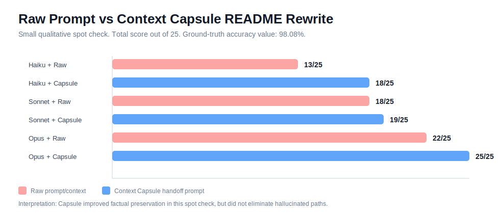

# Agent README Comparison Spot Check

This is a small qualitative spot check, not a benchmark claim.

The goal was to compare how different model tiers rewrite a portfolio README when given:

1. Raw prompt/context only.
2. Context Capsule output plus the same request.

The tested task was a portfolio README rewrite for a separate project. The ground-truth accuracy value was `98.08%`.

## Result Summary

| Agent setup | 30-sec grasp | Tech emphasis | Numeric accuracy | Portfolio structure | Why/story | Total |
| --- | ---: | ---: | --- | ---: | ---: | ---: |
| Haiku + Raw | 3 | 3 | wrong: `98.6%` | 2 | 1 | 13/25 |
| Haiku + Capsule | 4 | 4 | correct: `98.08%` | 3 | 3 | 18/25 |
| Sonnet + Raw | 4 | 4 | wrong: `98.6%` | 4 | 2 | 18/25 |
| Sonnet + Capsule | 4 | 4 | correct: `98.08%` | 4 | 3 | 19/25 |
| Opus + Raw | 5 | 5 | correct: `98.08%` | 5 | 3 | 22/25 |
| Opus + Capsule | 5 | 5 | correct: `98.08%` | 5 | 5 | 25/25 |



## What Improved With Capsule

- All Capsule runs preserved the audited `98.08%` value.
- Raw runs preserved the audited value only when it was explicitly provided strongly enough in the prompt.
- Capsule runs gave the model a clearer project story and reduced vague portfolio wording.
- The strongest result was `Opus + Capsule`, which combined correct metrics, a clearer why-story, and stronger engineering decision framing.

## What Did Not Automatically Improve

Capsule is not a hallucination shield.

In the `Haiku + Capsule` run, the model preserved the numeric value but invented paths such as:

```text
ml/classifier.py
analysis/opportunity_score.py
```

That is a real failure mode. Context Capsule can provide better context, but the final AI output still needs:

- path verification
- screenshot verification
- metric verification
- human review before publishing

## Portfolio README Lessons

For a portfolio README, the following checks mattered more than a longer generated document:

- Add real dashboard screenshots instead of text-only claims.
- Keep metric values consistent with the source evidence.
- Remove student-like sections such as `배운 점` if the target is hiring review.
- Avoid fake file paths. If a path is not in the repository, it should not appear in the README.
- Make the why-story visible in the first 30 seconds.

## Interpretation

This spot check supports a narrow claim:

```text
Focused capsule context can improve factual preservation and story quality in README rewrite tasks.
```

It does not prove:

```text
Capsule always makes a weaker model perform like a stronger model.
Capsule eliminates hallucination.
Capsule guarantees correct portfolio output.
```

The safe product claim is:

```text
Context Capsule helps prepare a smaller, more grounded handoff prompt, but generated output still needs human review.
```

## Next Validation Step

Turn this into a repeatable benchmark:

- 5 repositories
- 3 task types: README rewrite, bug-handoff prompt, GitHub issue draft
- raw prompt vs capsule prompt
- score with a fixed rubric
- track numeric accuracy, fake path count, story quality, and reviewer usefulness
