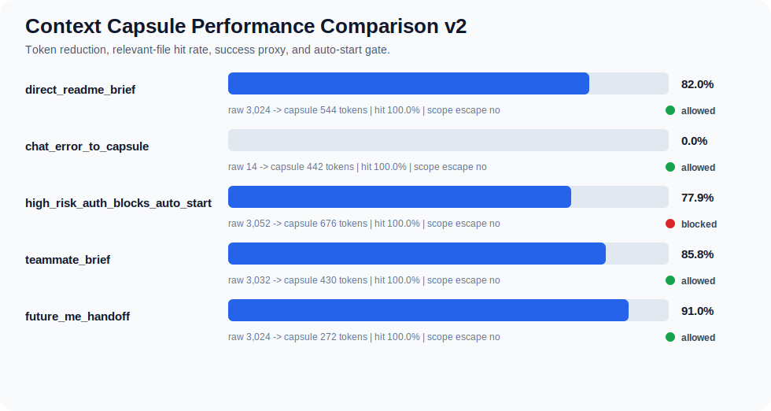

# Performance Comparison

Generated at: 2026-06-23 08:56:12

This report is generated from the MVP validation scenarios.



## Summary

- Scenarios validated: 5
- Best token reduction: future_me_handoff (91.3%)
- Auto-start blocked scenarios: high_risk_auth_blocks_auto_start

## Metrics

| Scenario | Auto Start | Raw Tokens | Handoff Tokens | Reduction | Chunks | Risks |
| --- | --- | ---: | ---: | ---: | ---: | ---: |
| direct_readme_brief | allowed | 3,052 | 1,310 | 57.1% | 5 | 0 |
| chat_error_to_capsule | allowed | 3,052 | 398 | 87.0% | 2 | 2 |
| high_risk_auth_blocks_auto_start | blocked | 3,052 | 1,409 | 53.8% | 7 | 2 |
| teammate_brief | allowed | 3,052 | 567 | 81.4% | 6 | 0 |
| future_me_handoff | allowed | 3,052 | 265 | 91.3% | 0 | 0 |

## How To Regenerate

```powershell
.\.venv\Scripts\python.exe scripts\generate_performance_report.py
```
