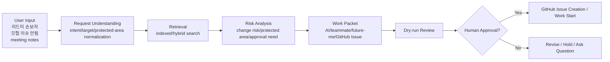

# v1.0 Roadmap

Context Capsule should reach v1.0 as a market-ready local workflow tool, not as a claim-heavy AI model project.

The path to v1.0 is:

```text
reliability
-> operating workflow
-> packaging UX
-> external validation
-> public beta readiness
```

## Version Flow

```mermaid
flowchart TD
    A[v0.1.0<br/>Local App MVP<br/>ZIP download · bat launcher · Streamlit dashboard]
    --> B[v0.1.1<br/>Reliability Hotfix<br/>retrieval/risk/token baseline honesty]

    B --> C[v0.1.2<br/>Request Understanding Layer<br/>user phrasing → intent/target/protected-area normalization]

    C --> D[v0.1.3<br/>GitHub First Impression<br/>README · Release ZIP · QA report visibility]

    D --> E[v0.2.0<br/>Scrum & Kickoff Packet Modes<br/>meeting/kickoff notes → decisions/questions/actions/issues]

    E --> F[v0.3.0<br/>Project Kickoff Mode<br/>topic → MVP scope/work breakdown/submission checklist]

    F --> G[v0.4.0<br/>Retrieval Evaluation<br/>hit@1/hit@3 · irrelevant count · clarification accuracy]

    G --> H[v0.5.0<br/>Workflow Integrations<br/>Discord input · GitHub Issue/label/branch recommendation]

    H --> I[v0.6.0<br/>Token Analyzer Adapter<br/>actual token analyzer · estimate/actual separation]

    I --> J[v0.7.0<br/>Security & Local Packaging<br/>security baseline · secret scan · executable packaging review]

    J --> K[v0.8.0<br/>Beta Release<br/>external user tests · bug reports · QA 50-100 cases]

    K --> L[v0.9.0<br/>Release Candidate<br/>install UX · docs · pricing/license policy]

    L --> M[v1.0<br/>Market-ready Local Workflow Tool<br/>downloadable AI work handoff product]
```



## Version Goals

| Version | Goal | Completion Criteria |
| --- | --- | --- |
| v0.1.0 | Local execution MVP | ZIP download -> `run_context_capsule.bat` -> dashboard usable |
| v0.1.1 | Core reliability patch | mentioned-file retrieval, negated risk handling, honest token denominator |
| v0.1.2 | User phrasing understanding | handles `리드미 손보자`, `깃헙 이슈 안됨`, `auth는 건드리지 말고` |
| v0.1.3 | GitHub first impression | README top, Release ZIP, QA report links, demo route aligned |
| v0.2.0 | Scrum and Kickoff Packet Modes | meeting/kickoff notes become decisions, questions, next actions, role-discussion prompts, and issue drafts |
| v0.3.0 | Project Kickoff Mode | project topic becomes MVP scope, work breakdown, and submission checklist |
| v0.4.0 | Retrieval quality evaluation | hit@1, hit@3, protected false positive, clarification accuracy measured |
| v0.5.0 | Collaboration integration | Discord input, GitHub Issue workflow, branch/label recommendation |
| v0.6.0 | Token measurement adapter | external Token-analyzer or provider usage comparison |
| v0.7.0 | Security and packaging | secret leak prevention, localhost safety, executable packaging review |
| v0.8.0 | KDT beta | 3-5 KDT/external users, bug reports, QA set expanded to 50-100 cases |
| v0.9.0 | Release candidate | docs, install UX, feedback loop, and safety checks stabilized |
| v1.0 | Public beta-ready product | a new user can download, run, understand value, and use it on a real project |

## v1.0 Product Flow



## Product Principles

Must not:

- auto-evaluate teammates
- auto-assign owners
- auto-submit contest/project work
- auto-edit code
- auto-merge or deploy

Should:

- recommend next actions
- generate issue drafts
- warn about risky areas
- use dry-run by default
- require human approval before real writes or risky work

## v1.0 Validation Gate

Before calling the product v1.0:

- [ ] User-speech QA has 50-100 cases.
- [ ] Target file `hit@1` and `hit@3` are measured.
- [ ] Protected-area false positive rate is measured.
- [ ] Clarification-only accuracy is measured.
- [ ] Token baseline clearly separates estimated and actual usage.
- [ ] GitHub Issue dry-run/apply is stable.
- [ ] Windows clean-environment ZIP execution is verified.
- [ ] A new user can follow the README without help.
- [ ] Security baseline passes.
- [ ] Pricing/license policy is written.

## Commercialization Deferred

Commercialization is not the current goal.

The current goal is:

```text
build a useful public beta
give it to KDT learners
collect real failure cases
improve reliability and UX
```

The product should still not be presented as:

```text
AI agent system
RAG model
guaranteed token reducer
autonomous coding tool
```

The public beta should be presented as:

```text
local-first work handoff tool for safer AI-assisted development practice
```

Repository strategy:

```text
public repo = portfolio/local MVP/KDT beta proof
private repo = optional future product experiments
```

Details:

```text
docs/kdt_beta_test_plan.md
```

Users should test whether it actually helps with:

- less repeated project explanation
- fewer wrong-file edits by AI tools
- clearer handoff to teammates
- GitHub Issue drafts from vague tasks or meeting notes
- local-first handling of repository context
- visible risk and approval gates

## One-Line Roadmap

```text
v0.1.x = safely hand off one task
v0.2.x = turn meeting notes into work packets
v0.3.x = structure project kickoff
v0.5.x = connect team workflow tools
v1.0 = downloadable local AI work handoff product
```
